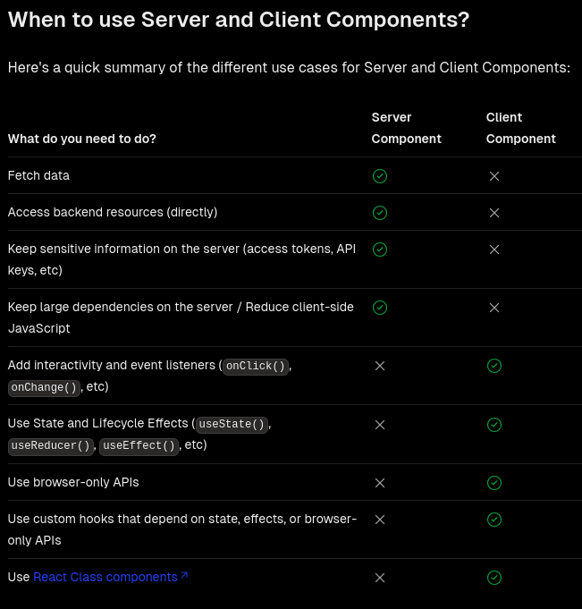
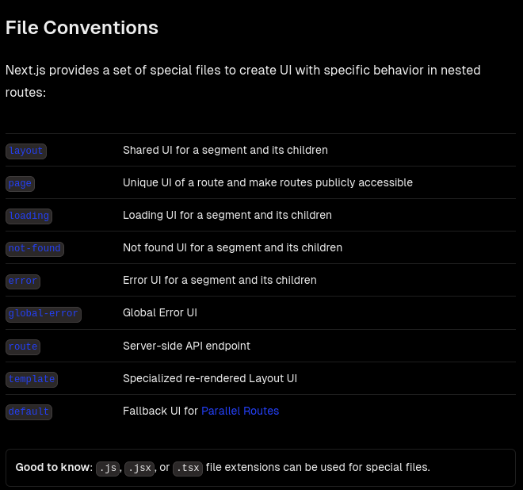
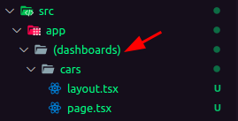
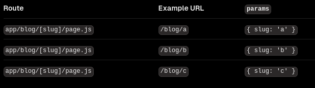
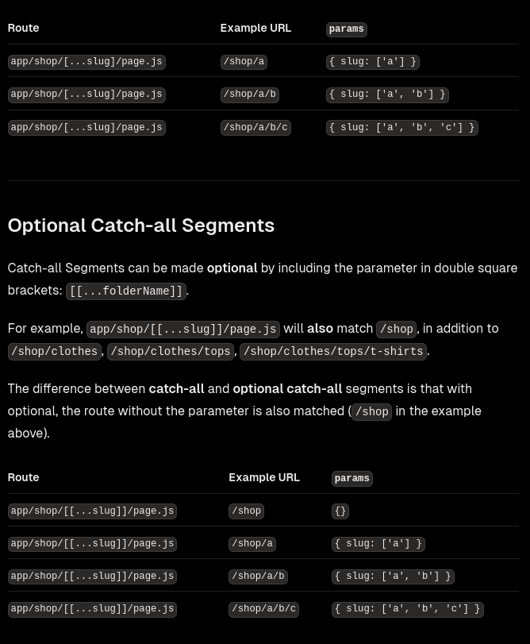

# NextJS com app-router

## Server-components vs Client-components

Tudo é **server-component** (o server rodando nodeJS/nextJS parsea os dados e renderiza os arquivos .html, .css, .js, etc. para que seja enviado ao client), a menos que coloque **'use client'** para usar o **client-component** (renderização por parte do cliente).

[Quando usar Server-component e quando usar Client-component](https://nextjs.org/docs/app/building-your-application/rendering/composition-patterns).



Um server component pode ter um client-component child mas o contrário não. A não ser que passe como props/children.

```javascript
/*
ServerComponent.tsx
*/
export default async function ServerComponent(){
    const cars = await fetch('localhost:3000').then(response => response.json());

    return
    <>
        {
            React.Children.toArray(cars.map((car) => <li>{car}</li>))
        }
    </>;

}

/*
ClientComponent.tsx
*/
import { renderToString } from "react-dom/server";

'use client'
export default ClientComponent({cars, children}:
{cars?: React.ReactNode, children?: React.ReactNode}){
    cars && console.log(renderToString(cars));
    return (
        <>
            {cars && <cars/>}
            {children && <children/>}
        </>
    );
}

/*
ServerComponentFather.tsx
*/
export default function ServerComponentFather(){
    return (
		<>
			<ClientComponent cars={ServerComponent}/>
			<ClientComponent>
				<ServerComponent/>
			</ClientComponent>
		</>
    );
}
```

## File System

[Routing Fundamentals](https://nextjs.org/docs/app/building-your-application/routing).



-   **Layout:**
    O componente/página que envolve as páginas. (semelhante ao \_app, \_document)

```xml
<Layout>
    <Page/>
</Layout>
```

> **Obs. Os layout são montados uma única vez.**
> Isto quer dizer que um estado (**useState** que estiver sendo usado em um layout.tsx -> 'use client') é compartilhado na mudança de rota em que um layout esteja sendo compartilhado.
> **Obs. No caso o RootLayout nunca é desmontado**
> Ou seja, se tiver um estado lá ele vai ser repassado até acontecer um refresh na página.

```xml
<Layout>
	<LoginPage />
	<SignupPage />
</Layout>
```

```javascript
"use client";
export default function Layout({ children }: { children: React.ReactNode }) {
	const [contador, setContador] = useState(0);
	return (
		<div>
			{/*
		Nesse caso esse botão irá ser mostrado e compartilhar o valor do estado tanto na rota de login, quanto de signup
		*/}
			<button onClick={setContador((prev) => prev + 1)}>
				Contador: {contador}
			</button>
			{children}
		</div>
	);
}
```

-   **Page:**
    É o arquivo de página(rota de página a ser mostrada).

-   **Loading:**
    É o arquivo de página de Loading. Página que irá aparecer enquanto a page.tsx (server-component) está realizando suas chamadas e sendo renderizada.
    Enquanto a page.tsx está fazendo o fetch e logo após parseando e renderizando a mesma, é exibido a loading.tsx que está no mesmo nível.

-   **Template:**
    É igual ao **Layout** só que ele é montado toda vez que é navegado.

-   **Route:**
    É utilizado para criar um endpoint de requisições REST.
    [Route Handlers](https://nextjs.org/docs/app/building-your-application/routing/route-handlers#supported-http-methods).

    > **Não pode ter um arquivo route.js|ts e um page.tsx no mesmo nível.**
    > _Each route.js or page.js file takes over all HTTP verbs for that route._

    ```typescript
    export async function POST() {
    	const res = await fetch("https://data.mongodb-api.com/...", {
    		method: "POST",
    		headers: {
    			"Content-Type": "application/json",
    			"API-Key": process.env.DATA_API_KEY!,
    		},
    		body: JSON.stringify({ time: new Date().toISOString() }),
    	});
    	const data = await res.json();
    	return Response.json(data);
    }
    /*-----------------------------------------------*/
    import { cookies } from "next/headers";

    export async function GET(request: Request) {
    	const cookieStore = cookies();
    	const token = cookieStore.get("token");

    	return new Response("Hello, Next.js!", {
    		status: 200,
    		headers: { "Set-Cookie": `token=${token.value}` },
    	});
    }
    /*--------------------------------------------------*/
    import { headers } from "next/headers";

    export async function GET(request: Request) {
    	const headersList = headers();
    	const referer = headersList.get("referer");

    	return new Response("Hello, Next.js!", {
    		status: 200,
    		headers: { referer: referer },
    	});
    }
    ```

## Route Groups

[Route Groups - agrupar rotas para não impactar na URL](https://nextjs.org/docs/app/building-your-application/routing/route-groups).



## Dynamic Routes

[Dynamic Routes - aceita algum parametro na rota (/:id)](https://nextjs.org/docs/app/building-your-application/routing/dynamic-routes).

```javascript
export default function Page({ params }: { params: { slug: string } }) {
	return <div>My Post: {params.slug}</div>;
}
```



**Generating Static Params**
The generateStaticParams function can be used in combination with dynamic route segments to statically generate routes at build time instead of on-demand at request time.

```javascript
export async function generateStaticParams() {
	const posts = await fetch("https://.../posts").then((res) => res.json());

	return posts.map((post) => ({
		slug: post.slug,
	}));
}
```

**Catch-all Segments**

> [...folderName].

**Optional Catch-all Segments**

> \[[...folderName]].



## Metadatas

Como modificar as metadatas tag(title, keywords, description):
[Metadata Object and generateMetadata Options](https://nextjs.org/docs/app/api-reference/functions/generate-metadata).

```javascript
import { Metadata } from "next";

type Props = {
  params: { marca: string }
  searchParams: { [key: string]: string | string[] | undefined }
}

// either Static metadata
export const metadata: Metadata = {
	title: "...",
};

// or Dynamic metadata
export async function generateMetadata({ params, searchParams }: Props) {
	return {
		title: `${params.marca} | title`,
	};
}
```

É somente exportar essa constante ou essa função de geração de metadata de dentro de layout ou pages.
